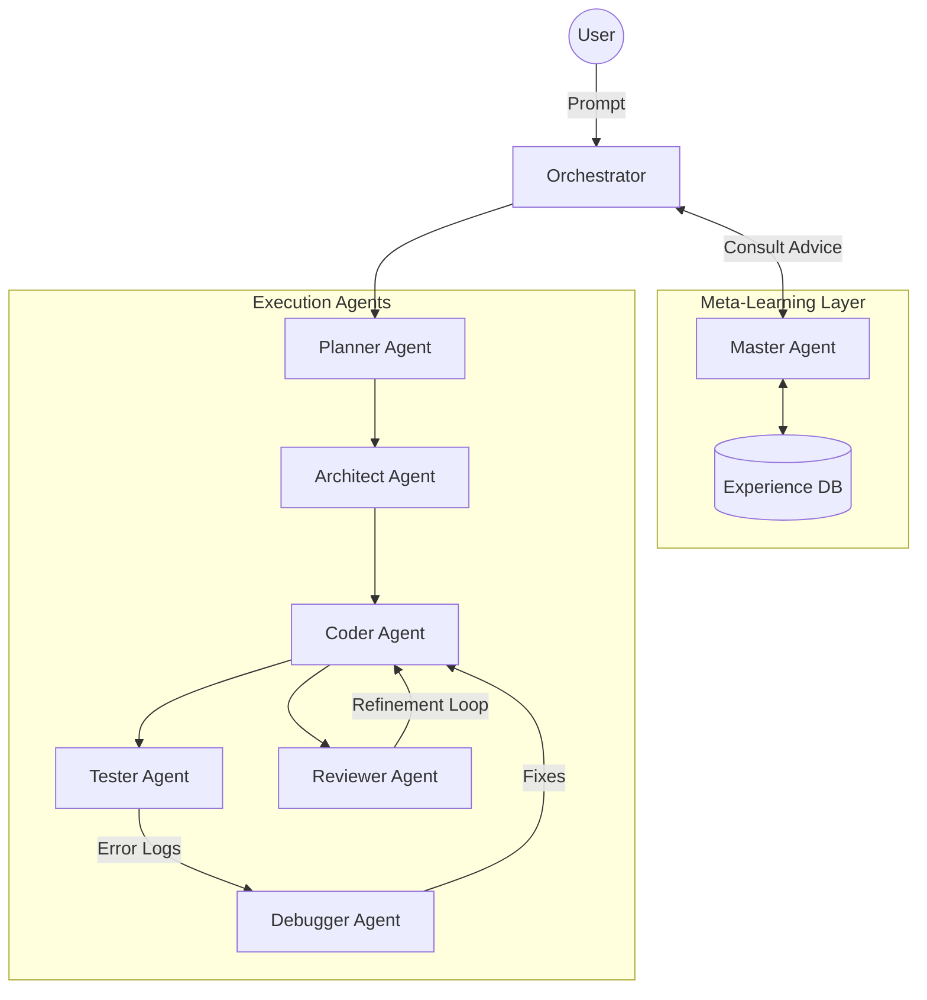

# 🏗️ God-Level AI Developer System - Architecture

## 🎭 Multi-Agent Intelligence Layer

The system operates using a hierarchical multi-agent orchestration, supervised by the **Master Agent (Meta-Learner)**.

## 🧠 Key Components

### 1. Master Agent (The Brain)
- **Role**: Learns from historical data and external logs.
- **Function**: Distills patterns from chat history and build failures.
- **Memory**: Persistent Vector Store (ChromaDB) for long-term lesson retention.

### 2. Execution Agents
- **Planner**: Breaks down complex requests into actionable steps.
- **Architect**: Designs the system folder structure and defines file roles.
- **Coder**: Generates production-ready code emphasizing safety and logic.
- **Tester**: Automatically writes and executes Pytest/Unit tests.
- **Debugger**: Performs project-wide trace analysis and multi-file fixes.
- **Reviewer**: Audits code quality and security, triggering the Reflection Loop.

### 3. Experience Flow
1. **Importing**: User imports chat logs (from Cursor/GPT) or URLs.
2. **Extraction**: Master Agent uses LLM to identify coding preferences.
3. **Storage**: Patterns are indexed in Experience DB.
4. **Retrieval**: Orchestrator queries DB for advice before every new task.
5. **Continuous Learning**: Failed builds are analyzed by the Master Agent to prevent future repeating of mistakes.